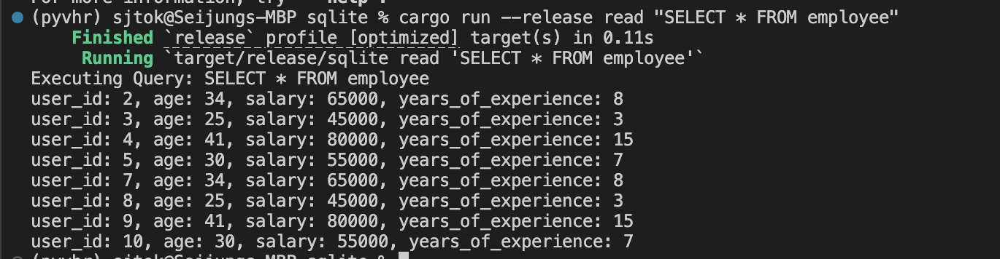

Check CI/CD Status:
[](https://github.com/nogibjj/kim_seijung_individual_project2/actions/workflows/cicd.yml)

# Individual Project #2
#### Repo Title: Rust CLI Binary with SQLite
#### Author: Seijung Kim (sk591)

## Overview
This project aims to provide a Rust-based Command Line Interface (CLI) tool that interacts with an SQLite database. The tool allows users to perform common database operations through CRUD (Create, Read, Update, Delete) commands, and it supports loading data into the database from a CSV file. The project leverages Rust's performance and type safety, making it an ideal solution for small-scale database management tasks.

The CLI is designed to be intuitive, with commands that can be executed directly from the terminal. Users can create tables, read data, update records, delete entries, and load data from CSVs. This project demonstrates the seamless integration of SQLite with Rust, providing a solid foundation for more complex database-driven applications.

## Requirements/Deliverables
* Rust source code: The code should comprehensively understand Rust's syntax and unique features.
* Use of Github Copilot (Use of other LLMs): In your README, explain how you utilized Github Copilot.
* SQLite Database: Include a SQLite database and demonstrate CRUD (Create, Read, Update, Delete) operations.
* Optimized Rust Binary: Include a process that generates an optimized Rust binary as a Gitlab Actions artifact that can be downloaded.
* README.md: A file that clearly explains what the project does, its dependencies, how to run the program, and how Gitlab Copilot was used.
* Github/Gitlab Actions: A workflow file that tests, builds, and lints your Rust code.
* Video Demo: A YouTube link in README.md showing a clear, concise walkthrough and demonstration of your CLI binary.

## How to Use

1. First, make sure you have the following prerequisites:
* Set up your Rust environment. Verify your installation using `cargo --version` or use the rustup tool to install Rust with `curl --proto '=https' --tlsv1.2 -sSf https://sh.rustup.rs | sh`.
* Have this repostiory cloned into your local machine using `git clone <repository_url>`.
2. Fetch the required dependencies and libraries.

```bash
cargo add clap --features derive
cargo add rusqlite
cargo add csv
```

3. Navigate to the root project directory and build the project's binary executable by running the `cargo build --release` command. This will compile the project and create a release version of the binary executable in the target/release directory.
4. Navigate to the sqlite/target/release directory and run the binary executable using available commands (such as create, read, update, etc.). You can run `./sqlite --help` to view the list of commands. Please go to the CLI Commands section of this README to view the full range of available commands and options.

### CLI Commands
Please refer to the following table to find all the commands you can execute with this CLI tool.


| **Command** | **Description** | **Generic Form** |
|-------------|-----------------|------------------|
| `create`    | Creates a table in the database | `./sqlite create <table_name>` |
| `read`      | Executes a SQL query on a table | `./sqlite read --query "<sql_query>"` |
| `update`    | Updates a specific record in a table | `./sqlite update <table_name> <id> <name> <age> <salary> <years_of_experience>` |
| `delete`    | Deletes a specific record from a table | `./sqlite delete <table_name> <id>` |
| `load`      | Loads data from a CSV file into a table | `./sqlite load <table_name> <file_path>` |


## How GitHub Copilot Was Used in this Project

- **SQL Query Structuring**: Copilot suggested optimized query structures, such as parameterized queries, which not only improved security (preventing SQL injection attacks) but also helped in making the code more modular and readable.

- **Testing Assistance**: During the implementation of unit tests, Copilot provided templates for writing test cases that checked database integrity after performing operations like creating, reading, and deleting records.

- **Documentation and Help Commands**: Copilot suggested text for the CLI's help commands, making it easier to provide detailed descriptions of each subcommand and argument in the CLI interface.

By using GitHub Copilot, I was able to speed up the development of the project, reduce the likelihood of bugs, and enhance the code’s efficiency and readability. Copilot was particularly helpful for generating code in Rust, a language I'm still becoming more familiar with, and it also helped in maintaining best practices for database interaction and error handling.


## Demo Video


## Screenshots of CLI Usage
* Create

* Read

* Update

* Delete
